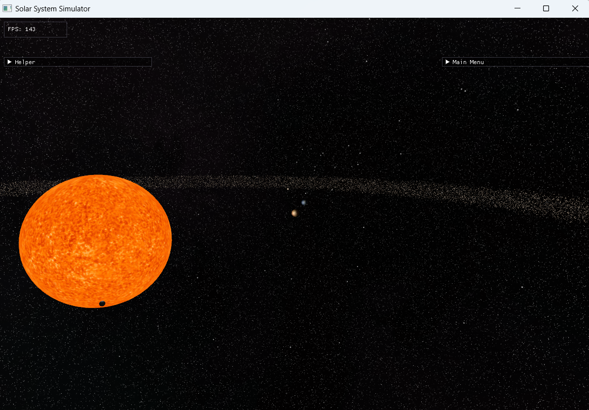
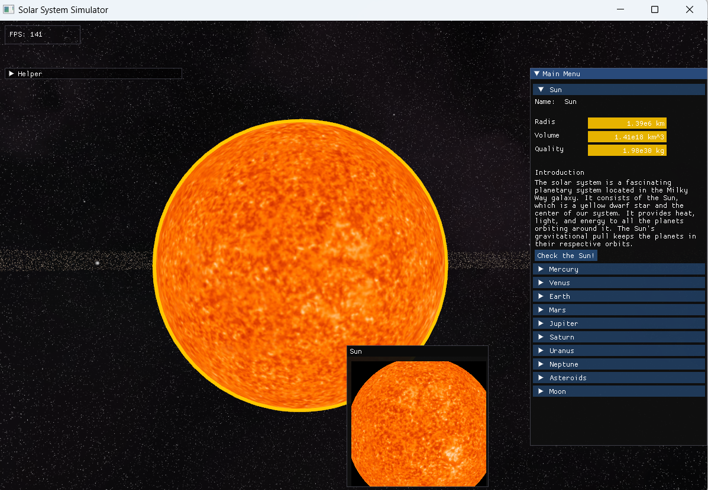
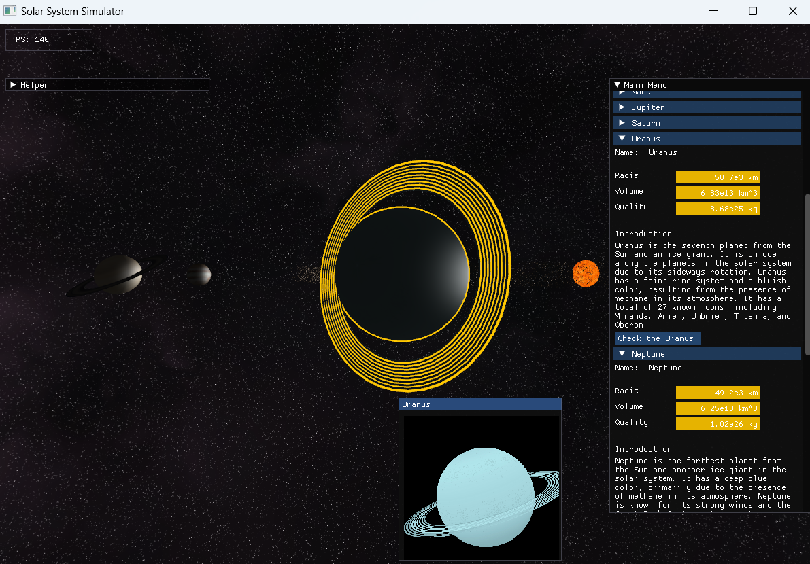
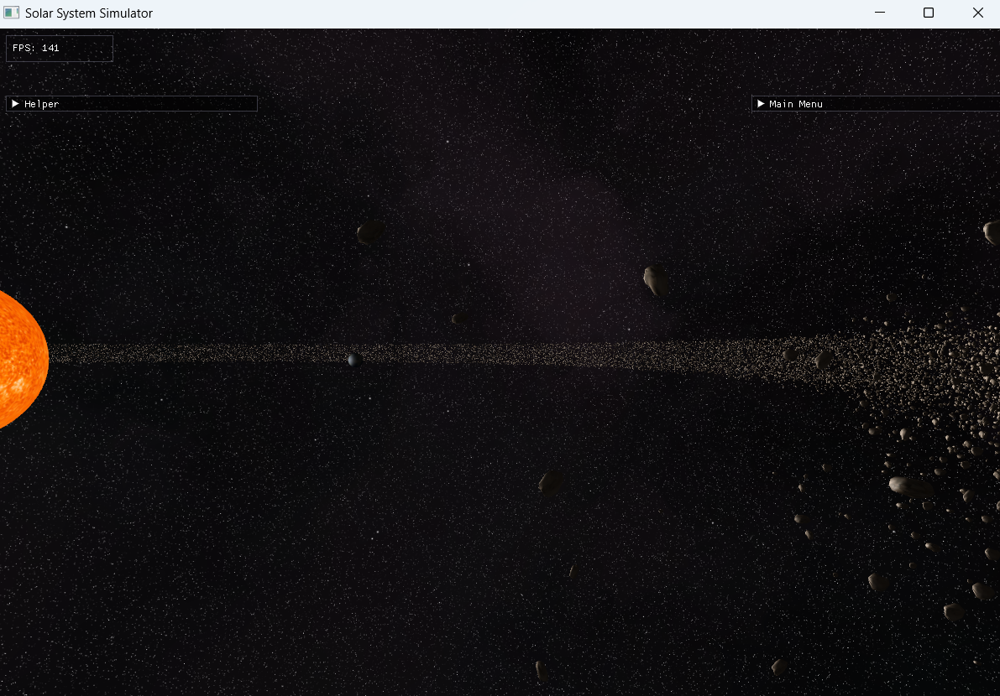

# 太阳系模拟器

本项目是用openGL构建的C++项目，项目模拟搭建了一个太阳系的场景，玩家可以通过W、A、S、D以及鼠标来操纵移动和视角的旋转，以此来观察太阳系的行星排布和构成。同时还为每个行星编写了资料简介，以供玩家了解各个行星的参数例如：体积、质量、直径等等，同时可以通过点击行星从而将视角聚焦到行星附近来近距离观察行星的构造。  

## 使用说明

本项目通过CMake构建，可以通过Cmake来编译项目，或者是直接下载已经编译好的压缩包来运行。

## 项目亮点

- 使用了BVH加速结构来加快射线检测。
- 使用FrameBuffer来储存渲染图像，并将其运用到UI。
- 使用Imgui构建UI，让玩家可以进行交互。

## 其余补充

OpenGL:3.30  
C++:17  
Compiler:VSC2022

